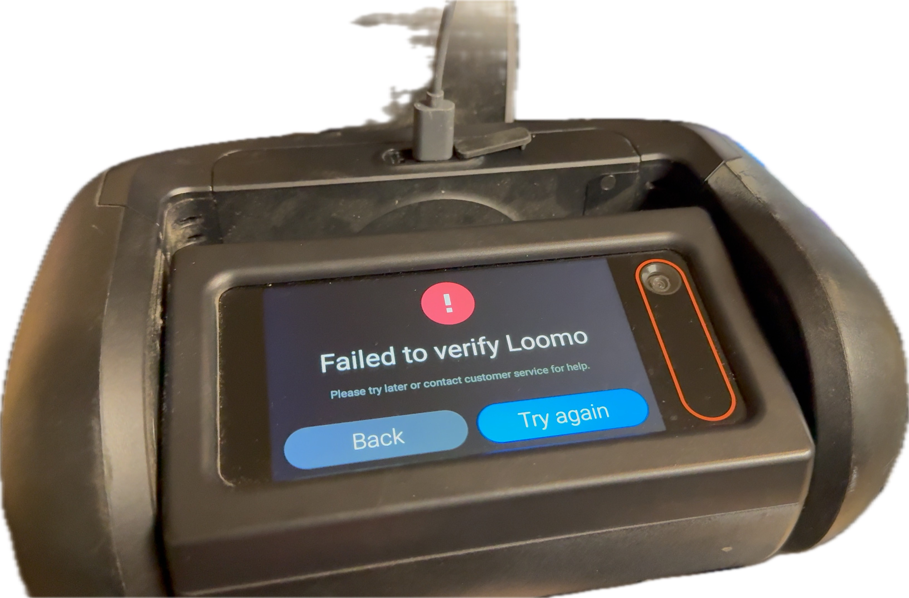
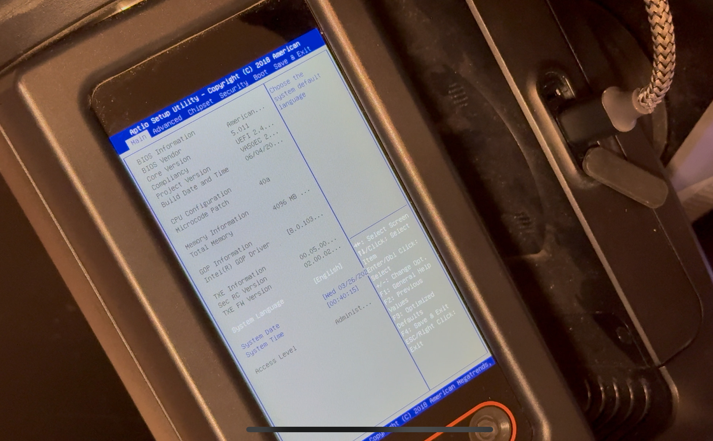
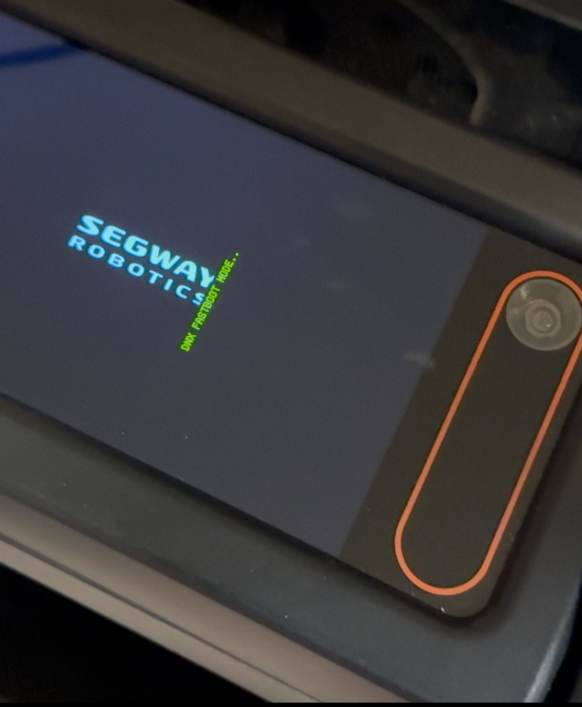
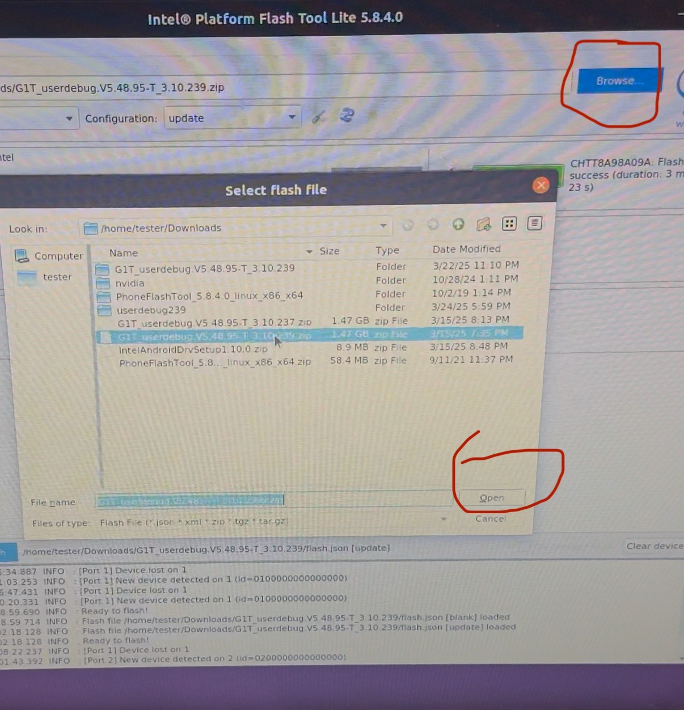
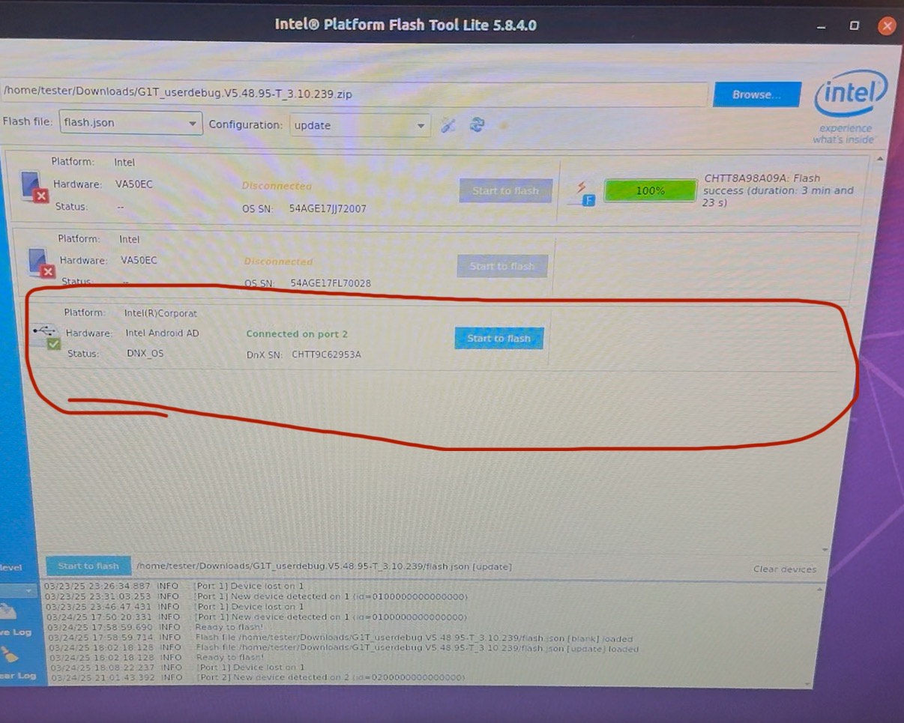
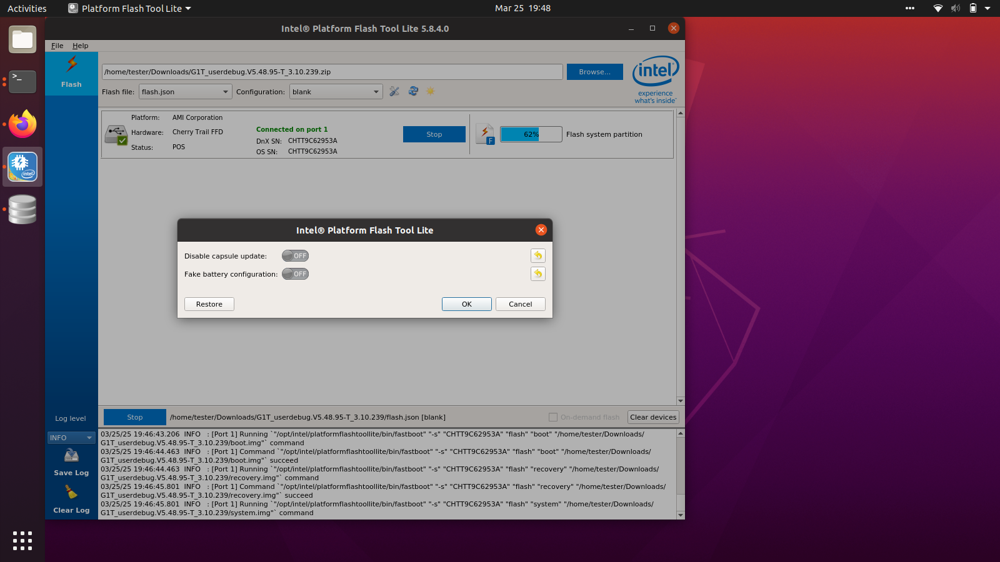
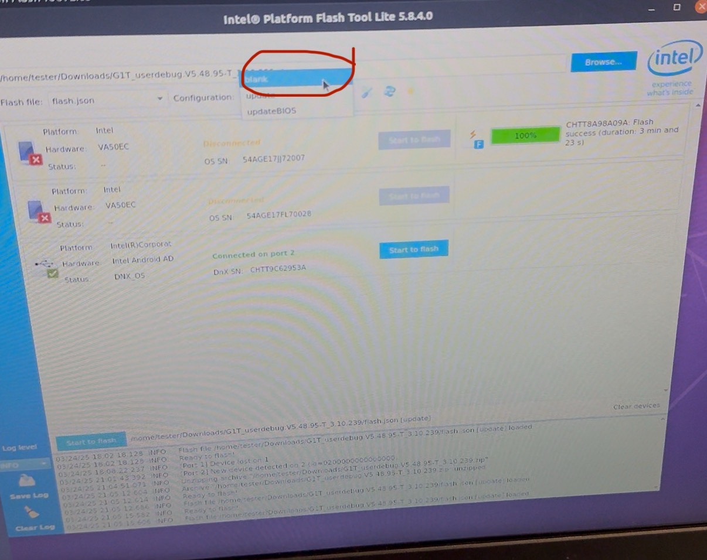
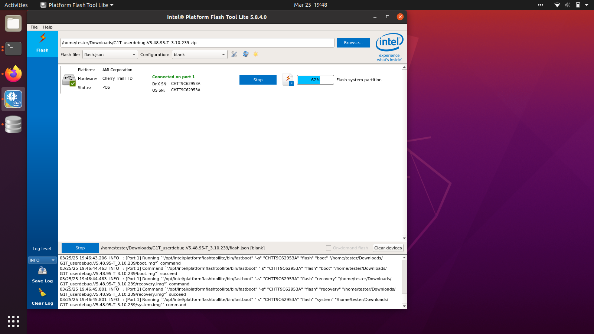
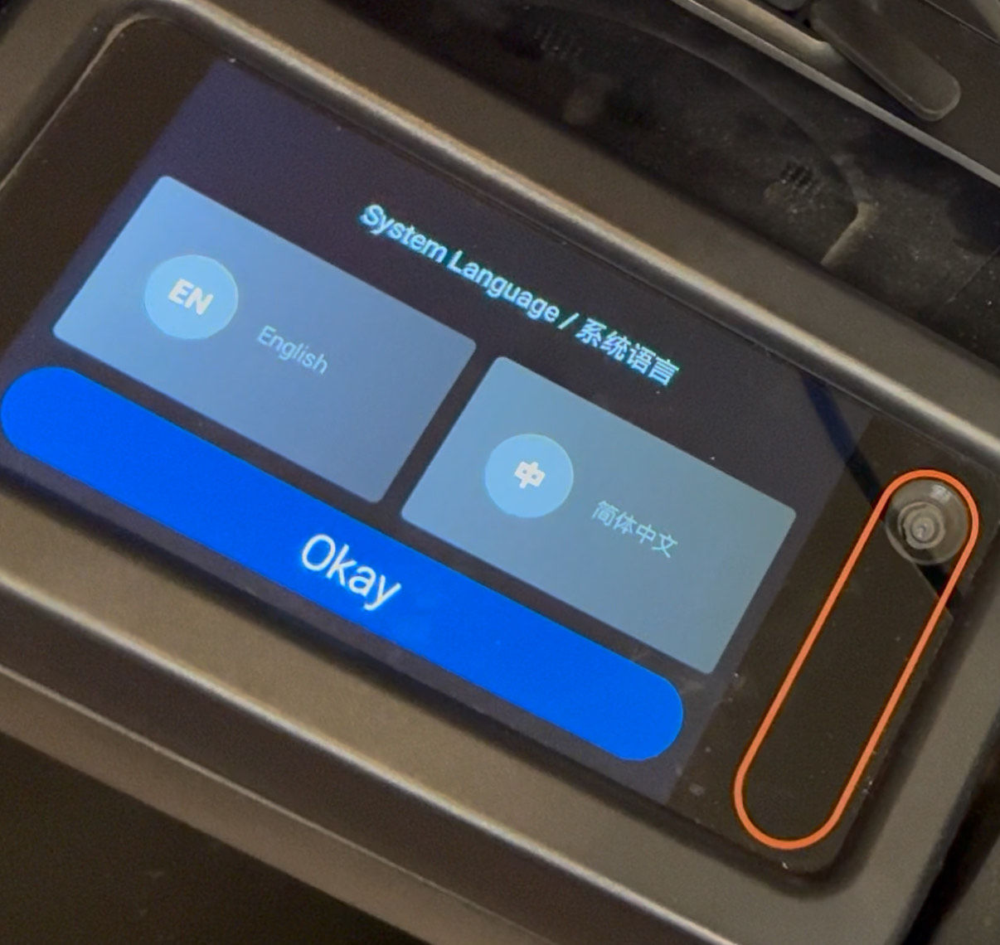

# loomo-jailbreak
Youtube tutorial video available [here](https://youtu.be/uUaLv8AlMkE).

## Introduction 
[On January 10th, 2025](https://service.segway.com/us-en/search/questionDetail?id=50629&esId=gK3myADgpJOndXksXwWMOoRkubM3Ma3Q&knowledgeType=paper&searchId=c2679a5e37f4cc4c133131d2f1cf9368) the application servers for the Segway-Ninebot Loomo robot were shut down. The application servers were responsible for activating Loomo robots and for sending OTA updates. The URL it was hosted at (https://api-g1-sg.segwayrobotics.com/) now throws a 502 Bad Gateway error when attempting to access it. This means that all Loomo robots not currently verified/activated yet are now just giant paperweights. I thought this was bad so I put together a "jailbreak" to get around this problem.



I've had experience tinkering with the Loomo robot and trying to reverse engineer some of its functionalities in the last few years. A few years ago I used Wireshark to capture the HTTP/HTTPS requests that the Loomo Settings app/OTA app makes when it checks for a software update. This is where I originally found the "verification servers" or the Loomo API server https://api-g1-sg.segwayrobotics.com/. After doing some poking around and looking at the REST API requests it was making for the update, I was able to play with the URL path and figure out how to change it to get a "userdebug" version of the sofware update which came across as a .zip file. This .zip file contained a rooted firmware image and after some digging and learning more about how other Android x86_64 Intel devices worked, I figured out the Intel Platform Flash Tool Lite could be used to flash this rooted Android image onto the Loomo and that gets you root access to Loomo which really isn't all that exciting _except_ in light of this shutdown of the API server it means there is now a way to un-paperweight the non-verified Loomos of the world. The following steps in this guide will explain how.

## Warning
Please only proceed with flashing your Loomo with the rooted firmware if you absolutely know what you are doing and also I would only recommend doing this if your Loomo is currently in a broken, non-activated state where you are stuck on the Provision app after boot. If your Loomo is already working fine, I would advise against doing this just to get root unless you absolutely understand the risks. I use my Loomo for all sorts of robotics research and never _once_ have I found root useful for anything (if you do however find root on Loomo useful or otherwise use the userdebug.zip to unlock new capabilities, please let me know and feel free to submit a PR documenting it on this repo). This is really a last resort for the people whose Loomo is currently not working. There is a risk that you will get stuck in a boot loop indefinitely or other terrible fates. Just warning you now.


## Jailbreak Outline
1. Put Loomo in DNX Fastboot mode from its BIOS so that it can receive a flash update.
2. Connect to Loomo while its booting into DNX Fastboot mode from a computer that has fastboot&adb + Intel Platform Flash Tool Lite installed on it.
3. Load up the userdebug.zip rooted Android image into Intel Platform Flash Tool Lite and begin flashing.
4. (Get Passed Provision App with Fake Verification Server) If all goes well, you'll be back to the Provision app on the language selection screen once flashing is complete, except this time you'll have root shell access over adb from boot.
5. Start a root shell over adb into the Loomo from the computer and set the robot mode to "gx" which tells the Provision App to treat the Loomo differently.
6. Start the fake verification server on your computer and put the activateurl with your computer's local IP on the Loomo's internal storage directory (this tells Loomo to point at a different verification server than the original one).
7. Select language and connect to same WiFi network that the computer is on. Loomo will connect out to the fake verification server and exit successfully to the Android Launcher in Developer Mode.
8. Reboot to restore all Android Launcher functionality.
9. Restore RobotMainApp for use in Developer Mode.
10. Restore Loomo Skills ("Ok Loomo", "Follow Me", etc.)
11. Set a User Id
12. (Optional) switch to User Mode and back again to Developer Mode if desired.
13. Disable Loomo speed limit.

## Prerequisites
* Laptop or PC running Ubuntu 20.04 (or 22.04 or 24.04 would probably work too).
* Keyboard that either has USB-C or you have a USB-A female to USB-C male adapter.
* USB-C to USB-A data cable.
* A Loomo.
* Loomo Android rooted image (userdebug.zip can be found [here for now](https://drive.google.com/file/d/1H36lfAd3v3aOTfvfhAiy2NpYObejuu4z/view?usp=sharing)).
* Clone or download this repo to your computer.


## Getting Started
Install the fastboot&adb utils
```
sudo apt update
sudo apt install android-tools-adb android-tools-fastboot -y
```

Install [Intel Platform Flash Tool Lite](https://github.com/projectceladon/tools) by downloading the Ubuntu 64-bit .deb version and once you have the file downloaded the command will be:
```
sudo dpkg -i ~/Downloads/platformflashtoollite_5.8.9.0_linux_x86_64.deb
```
(please note I have only tested with version 5.8.4.0 but it seems likely the latest version will also work)

## Jailbreak Steps
### Put Loomo in DNX Fastboot Mode
Before proceeding, make sure Loomo has atleast 75% or more of its battery.

Place Loomo face down on a table or the ground.

Connect your keyboard to the USB-C port on the back of Loomo's head.

Power on the Loomo while tapping the DEL (delete) key on the keyboard. This should result in you getting to the BIOS of Loomo.



From here navigate with the arrow keys to the "Advanced" column/tab and navigate further to the "System Component" row and press ENTER.

Scroll down to "DNX fast boot" and press ENTER and switch it to be "[Enabled]".

Then press ESC (escape) and navigate to the "Save & Exit" column/tab and hover over "Save Changes and Exit"

At this time, you need to have your USB-A to USB-C data cable plugged in to your laptop and have it ready and right next to the Loomo ready to be switched out with the keyboard. 
This is because, in order for the laptop to connect over fastboot to the Loomo, the cable will need to be connected before it finishes its next reboot.

Press ENTER on "Save Changes and Exit" and select "Yes" for saving the changes.
Now quickly replace the keyboard with the USB-A to USB-C data cable while the screen is black and before you see the "Segway Robotics" logo.

You should now see the "Segway Robotics" logo along with a text that says "DNX FASTBOOT MODE..." on the Loomo's screen.


On the computer, open a terminal and run `fastboot devices`, a device should be listed; _if_ no device is listed you did not connect the USB-C data cable in time between the Loomo and the computer from the time when you exited the BIOS and will need to repeat that step, you can turn off the Loomo and try again.

### Flashing Loomo
Make sure the userdebug.zip is downloaded onto your computer.

Launch the Intel Platform Flash Tool Lite and select the userdebug.zip. At this time you should see a device showing up as being connected; _if not_ you will need to redo the above DNX Fastboot mode step.




After the userdebug.zip gets loaded into the tool, you should select the wrench/screwdriver icon and MAKE SURE both options shown are OFF (not toggled on).



Make sure the second dropdown (to the right of the one that says "flash.json") has the option named "blank" selected.



You can now press "Start Flash". At this time you'll see the screen of Loomo list some logs as it gets flashed and you can watch the progress bar on the Intel Platform Flash Tool Lite GUI.



Once finished flashing (this can take 5 minutes) the Loomo may reboot a few times (this can additionally take 5-10 minutes) you will eventually end up on the Provision app "Select a system language" screen--this is a good sign.



_If_ it has been 20 minutes or more and you still have not gotten back to the Provision app then you may have gotten your Loomo stuck in a boot loop (or possibly bricked it). Try to power off and start again from the first step: putting the Loomo in DNX Fastboot mode.

### Jailbreaking out of Provision App
The Provision App is set as the preferred app to take a "HOME" Intent to start off with, this is why it appears immediately after boot-up if you haven't activated/verified yet.

To get around this fact, we will use our new powers of having root on the Loomo to set a property that will have Loomo treated as a debug unit that does not need to complete all the checks on Provision App (like having a mobile app connected, etc.).

Also note at this time, you should still be on the language selection screen. Do not move past that at this point in time.

Unplug then replug-in the USB-A to USB-C data cable (we do this every time the Loomo reboots because sometimes adb does not work whe a device is rebooted, it will sometimes say "offline", the remedy is just unplugging and replugging in the cable from one side of the connection).

Open a new terminal and type in `adb devices`. You should see a device listed (your Loomo). This is a nice little advantage that comes in handy for us from the userdebug image we just flashed: it enables root adb access from boot!

Type in `adb root` which puts Loomo in root mode.

Then type in `adb shell` which launches a root shell into the Loomo.

From here we need to set the property `ro.robot.mode` to "gx" on Loomo which we can do by running the following in the root adb shell:
```
setprop ro.robot.mode gx
```
You can verify you set this correctly by running:
```
getprop ro.robot.mode
```
This should return `gx` in the root adb shell.

Next, open up a terminal window and navigate to this repo. We will now start the Fake Verification Server which has the same endpoints that the Provision App reaches out to and mimics the response the Provision App is expecting.
Make sure you have python3 and pip installed. 

On your first time running this, you'll need to make sure you have the flask web server library installed. You can do this by running:
```
pip install flask
```

Now run the Fake Verification Server:
```
python fake_verification_server.py
```


Next, open up a terminal window or file explorer and navigate to this repo. Modify the `activateurl` file with your computer's local WiFi network IP address and place the file in the Loomo's internal storage directory which you can find my opening a file explorer window and clicking on the "mobile device" that is Loomo (sometimes shows up as VA50EC) and navigating to "Internal Storage". Then place the `activateurl` file that you modified to have your computer's local IP address in there.

Okay, the next step is to select a system language on Provision App on Loomo and also connect Loomo to the same WiFi network that your computer hosting the Fake Verification Server is on.

You should see logs on the Fake Verification Server indicating it got a request from the Loomo and sent a success response in the format that Provision App is expecting back to the Loomo.

The Provision App will then exit succesfully and launch into the Android Launcher in Developer Mode.

At this time, turn Loomo off and back on again in order to completely restore Android Launcher functionality like using Loomo's ears as Home Button presses, etc.
You can do this either by typing `reboot` into the root adb shell or by pressing the power button, whichever you prefer.

After reboot you now have a functioning Android Launcher in Developer Mode!

You have successfully jailbroken your Loomo and freed it from its fate as a giant paperweight!

_There's still a few more things to restore full functionality. Please see the setps below for help with that._

### Restore RobotMainApp (Loomo "eye" App) for Use in Developer Mode
By default the RobotMainApp, the Loomo "eye" interactive main app, is hidden in Developer Mode. We can fix this by typing in the following to a root adb shell:
```
pm enable com.segway.robot.host
pm enable com.segway.robot.host/com.segway.robot.skill.home.HomeActivity
```

If you open the app drawer of the Android Launcher, and scroll a few pages you will see the RobotMainApp is now available. This is great because now you can access the whimsical Loomo built-in functionality whenever you want to from Developer Mode which is the best of both worlds in my opinion.

Open the RobotMainApp atleast once as this is needed to initialize a few things we will need later. Once the loading spinner compeletes, tap the screen just to make sure the apps show up there. Upon exiting by tapping Loomo's ears as a Home Button press, it may ask you what you want to set as the Home Launcher. For now, choose the Android Launcher and tap the "Always" option on that one.

### Restore Skills ("Ok Loomo", "Follow Me", etc.) functionality 
Since the Loomo mobile app is no longer supported, the only way to "master" all the "skills" is to manually edit the DB records that represent them.

Make sure your computer is still connected via USB data cable and open a terminal and run:
```
adb root 
adb shell

sqlite3 /data/data/com.segway.robot.host/databases/robot.db

UPDATE SKILL_DATA_MODEL SET level=2 WHERE name='Voice';

UPDATE SKILL_DATA_MODEL SET level=2 WHERE name='Ride';

UPDATE SKILL_DATA_MODEL SET level=2 WHERE name='Camera basic';

UPDATE SKILL_DATA_MODEL SET level=2 WHERE name='Following shot';

UPDATE SKILL_DATA_MODEL SET level=2 WHERE name='Gallery';

UPDATE SKILL_DATA_MODEL SET level=2 WHERE name='Shadow';

UPDATE SKILL_DATA_MODEL SET level=2 WHERE name='Avatar';

UPDATE SKILL_DATA_MODEL SET level=2 WHERE name='Programming';

```
To verify all the skills were updated correctl, run:
```
SELECT * FROM SKILL_DATA_MODEL;
```
You should see a "2" by each row which indicates the skill level has been set to the maximum

Now exit the sqlite3 interactive shell with:
```
.exit
```

And reboot the Android table of Loomo so we can reload the skills we have modified:
```
# from the adb root shell
reboot

```

When it boots back up you should have full access now to things like saying "OK Loomo" and using the pre-programmed voice commands Loomo knows like "Take a picture" or "Follow me" from inside the RobotMainApp.

### Setting up a User Id
We skipped some of the initialization of the Provision App earlier when we set the property to "gx" and now one of those things we need to address, specifically setting a User Id. Now normally the User Id would be set when you first connect your phone that would have the Loomo mobile app on it with you being logged-in to an account. But because the Segway servers are shutdown now for the Loomo mobile app and the app itself being no longer hosted on the app stores, we have to add a User Id to Loomo ourselves.

Open a terminal window and start a root adb shell and type the following:
```
settings put secure user_id admin
```

### (Optional) Switch to User Mode (and back to Developer Mode when needed)
Because we set Loomo's robot mode property to "gx", the Provision App put us in Developer Mode which is the main mode for developers that just boots straight into an Android Launcher where you could customize things to launch say a different app on boot-up, you can side-load apps and install them from here, and you also have full access to all of the settings in the Settings App. User Mode on the other hand is the default mode of Loomo that launches the RobotMainApp on boot-up and kind of locks things down UI wise on what you can see and do. I personally don't ever use User Mode as it's more locked down and the only thing it has going for it is that it has the RobotMainApp launch on boot-up, but this can _easily_ be achieved on Developer Mode using several well known methods (not going to cover here but you can ask GPT about you can set an app to start automatically on boot-up).o

Anyways, I say all of that just to point out that User Mode isn't all that useful, but I want to cover how to get in to it _and back out of it_ if you ever need/want to.

Okay to get to User Mode from Developer Mode, simply open the Settings App and scroll down to find the Loomo Developer tab. From here, toggle the Developer mode option to Off. Loomo will reboot itself and upon boot-up you will see the RobotMainApp being launched. 

If you want to get back to Developer Mode, we have to set up a few things first. As an explanation, when you try to switch to Developer Mode from User Mode by switching the Developer mode toggle to ON in the Settings App, Loomo actually tries to reach out to the official Segway application servers that of course no longer exist. So to get around this, we are going to use the Fake Verification Server again as it also includes endpoints and success responses for talking to the Loomo Settings App for this.

Open a terminal and launch the Fake Verification Server:
```
python3 fake_verification_server.py
```

Update the `settings_test_url` file with the local IP address of your computer and place it in the internal storage directory of Loomo that shows up on your computer's file explorer.

Make sure the `fake_verification_server.py` is running and then go into Settings App --> Loomo developer --> toggle "ON" Developer mode and tap "Agree" if it asks you.

Once rebooted, you should be back to the Android Launcher and have full access in the Settings App UI to all settings and all the other benefits of Developer Mode.

It's important to point out that every time you go from User Mode to Developer Mode you will need to re-enable the RobotMainApp to have it show up in the app drawer of the Android Launcher. Please refer back to that section above.

### Remove Speed Limit
The Provision App invokes an artificial "speed limit" when we go through the initial provisioning process that is _supposed_ to get resolved when you connect your Loomo mobile app to Loomo and start riding it and what not, but because the Loomo mobile app is no longer available, we have to bypass this artificial speed limit through some other method.

It's _possible_ you don't have the speed limit restriction. You will know if you have it #1 by Loomo not allowing you to ride on it very fast and #2 by the speedometer LED icon being active above the battery LED icon:


I have written an APK file you can find on this repo called `loomorestorev1.apk`, it simply makes a call using the Loomo SDK to do the following:  `mBase.setRidingSpeedLimitEnable(false);` which is all it takes to get rid of the annoying speed limit thankfully.

Open a terminal window and make sure you are in this repo and then start an root adb shell and type the following:
``` 
adb install loomorestorev1.apk
```

Once that succeeds, open the app drawer on Loomo and find the Loomo Restore app and simply open it once and you will notice the speed limit icon above the battery instantly disappear which means the speed limit restriction is now gone, you can now reach the max speed of Loomo just fine now.

Feel free to uninstall the Loomo Restore app afterwards as its only purpose is this one time fix.

### The End
Congratulations, you have made it to the end and your Loomo is now free and restored back to where it should be! 


## Notes
* I plan to do more exploration of the rooted image and see if there's any other cool functionality that can be unlocked, but from my past research into this a couple years ago I've found that not much can really be gained (e.g. things like max_speed, etc. are not available on the Android layer of Loomo, they are controlled at the Segway controller firmware level).


## Donate
If this guide helped you, consider throwing me some beer money. A lot of effort went into pulling all of this research together into one place plus I risked my perfectly functional Loomo testing different firmware flashes and reverse engineering before publishing and the video took a long time to edit together. Cheers!
[](https://www.buymeacoffee.com/nullic)


